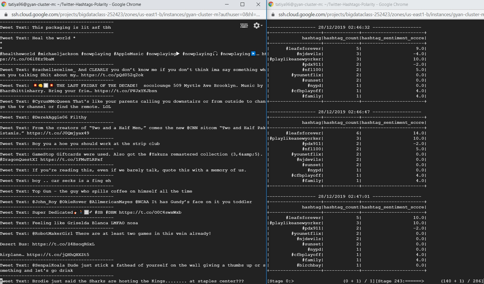
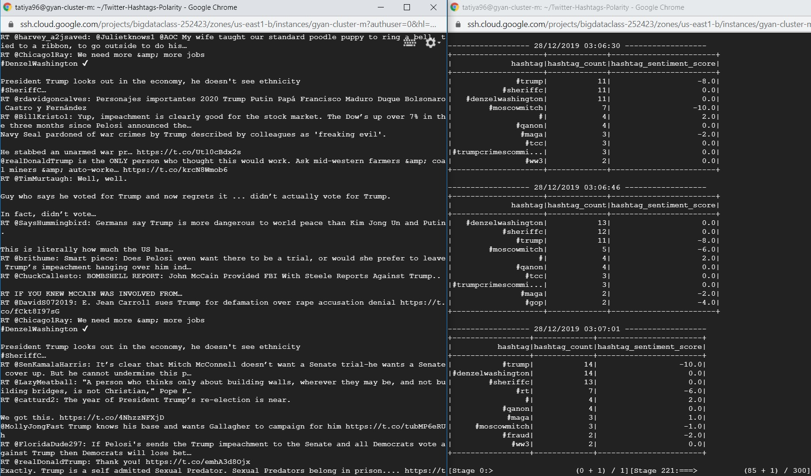
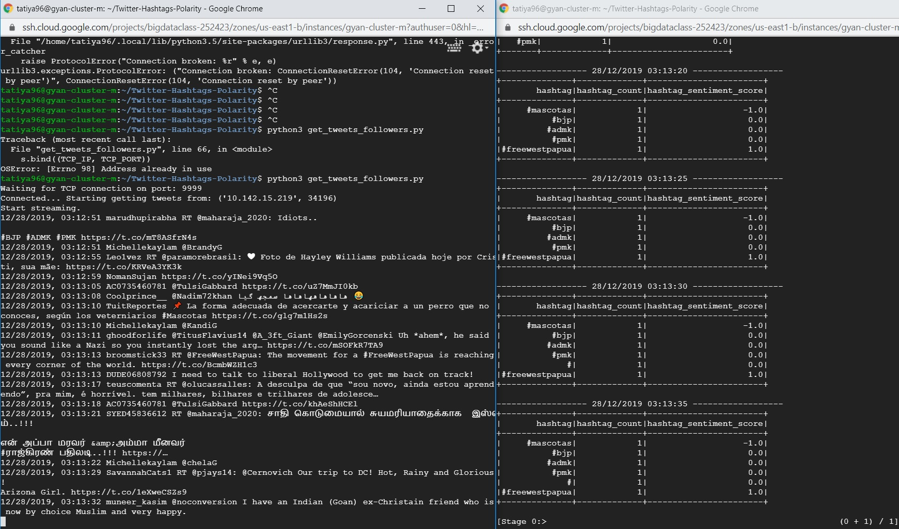

# Twitter Hashtags Polarity

This project fetches live Twitter data in a stream and computes polarity of tweets with hashtags based on "<a href="https://github.com/words/afinn-165/blob/master/index.json"><b>FINN-165 word polarity</b></a>" dataset, which contains a score from -5 to +5 for several words based on its sentiment.
A positive word has above 0 score and a negative word has below 0 value.
Top 10 most popular hashtags, its counts and its sentiment score is displayed.

## Development Environment

Google Cloud Dataproc image version: 1.3 (Debian 9, Hadoop 2.9, Spark 2.3)

## How to run the code?

### Get tweets based on a location

```
python3 get_tweets_location.py # TERMINAL 1
python3 spark_analyze.py # TERMINAL 2
```



### Get tweets based on a filter

```
python3 get_tweets_filter.py # TERMINAL 1
python3 spark_analyze.py # TERMINAL 2
```



### Get tweets based on followers of a user

```
python3 get_tweets_followers.py # TERMINAL 1
python3 spark_analyze.py # TERMINAL 2
```




